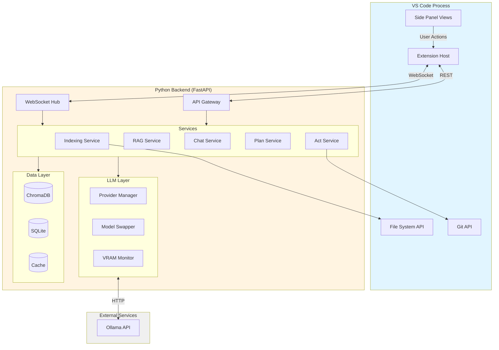
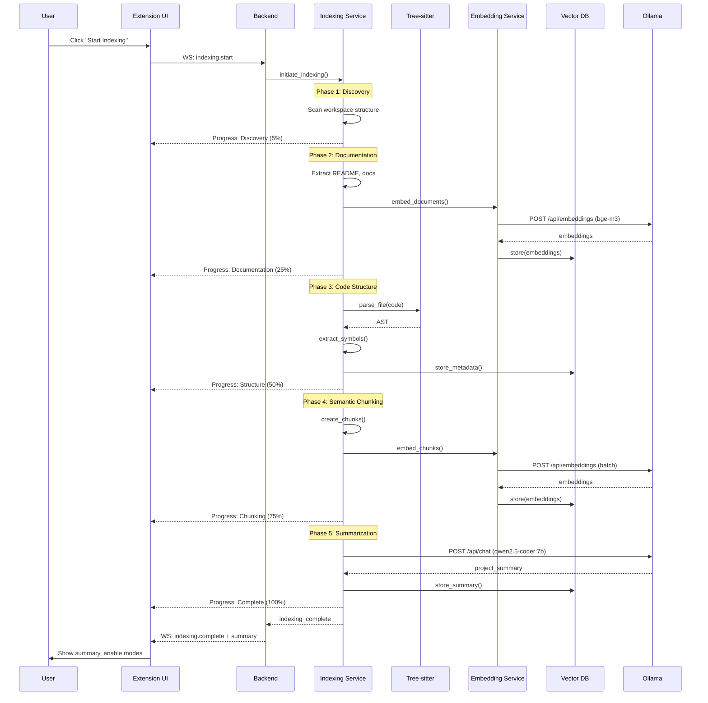
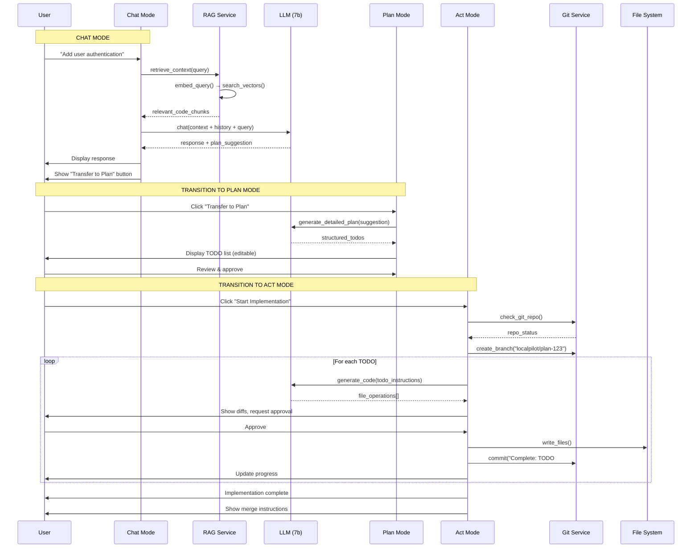

# 📄 DOCUMENT #2: TECHNICAL_ARCHITECTURE.md
# LocalPilot - Technical Architecture Document

**Version:** 1.0
**Date:** January 2025
**Status:** Foundation
**Author:** LocalPilot Architecture Team

---

## 📋 Table of Contents

1. [System Overview](#system-overview)
2. [Architecture Diagrams](#architecture-diagrams)
3. [Component Specifications](#component-specifications)
4. [Data Flow](#data-flow)
5. [Technology Stack](#technology-stack)
6. [Hardware Specifications](#hardware-specifications)
7. [Model Configuration](#model-configuration)
8. [Security & Safety](#security--safety)
9. [Performance Requirements](#performance-requirements)
10. [Scalability Strategy](#scalability-strategy)

---

## 🎯 System Overview

### Architectural Approach: **Hybrid Architecture**

LocalPilot uses a **hybrid architecture** combining:
- **TypeScript/Node.js Extension**: VS Code integration, UI, file operations
- **Python Backend**: LLM operations, RAG, embeddings, vector database
- **WebSocket Communication**: Real-time bidirectional messaging

```
┌─────────────────────────────────────────────────────────────┐
│                        VS CODE                              │
│  ┌───────────────────────────────────────────────────────┐  │
│  │           LocalPilot Extension (TypeScript)           │  │
│  │  ┌─────────────┐  ┌──────────────┐  ┌─────────────┐   │  │
│  │  │    Views    │  │   Commands   │  │  Services   │   │  │
│  │  │ (Side Panel)│  │   Handler    │  │   Layer     │   │  │
│  │  └──────┬──────┘  └──────┬───────┘  └──────┬──────┘   │  │
│  │         │                │                  │         │  │
│  │         └────────────────┴──────────────────┘         │  │
│  │                          │                            │  │
│  └──────────────────────────┼────────────────────────────┘  │
└─────────────────────────────┼───────────────────────────────┘
                              │ WebSocket / REST
                              │ (localhost:8765)
┌─────────────────────────────▼───────────────────────────────┐
│              Python Backend (FastAPI)                       │
│  ┌───────────────────────────────────────────────────────┐  │
│  │                    API Layer                          │  │
│  │         WebSocket Hub  │  REST Endpoints              │  │
│  └───────────┬────────────────────────┬──────────────────┘  │
│  ┌───────────▼────────────┐  ┌────────▼──────────────────┐  │
│  │   Service Layer        │  │   LLM Provider Layer      │  │
│  │ ┌──────────────────┐   │  │ ┌──────────────────────┐  │  │
│  │ │ Indexing Service │   │  │ │  Ollama Provider     │  │  │
│  │ │ RAG Service      │   │  │ │  (qwen2.5-coder)     │  │  │
│  │ │ Chat Service     │   │  │ │  Model Swapper       │  │  │
│  │ │ Plan Service     │   │  │ │  VRAM Monitor        │  │  │
│  │ │ Act Service      │   │  │ └──────────────────────┘  │  │
│  │ └──────────────────┘   │  └───────────────────────────┘  │
│  └────┬──────────────────┘                                 │
│  ┌────▼───────────────────────────────────────────────────┐  │
│  │              Data Layer                                │  │
│  │  ┌──────────────┐  ┌─────────────┐  ┌──────────────┐   │  │
│  │  │  ChromaDB    │  │  Metadata   │  │  Cache       │   │  │
│  │  │  (Vectors)   │  │  (SQLite)   │  │  (Redis opt) │   │  │
│  │  └──────────────┘  └─────────────┘  └──────────────┘   │  │
│  └────────────────────────────────────────────────────────┘  │
└─────────────────────────────┬───────────────────────────────┘
                              │
┌─────────────────────────────▼───────────────────────────────┐
│                      Ollama Service                         │
│                    (localhost:11434)                        │
│  ┌──────────────────────────────────────────────────────┐   │
│  │  Models:                                             │   │
│  │  • qwen2.5-coder:7b-instruct-q4_K_M  (4.5GB VRAM)   │   │
│  │  • qwen2.5-coder:14b-instruct-q4_K_M (9GB VRAM)     │   │
│  │  • bge-m3 (embeddings, 1.5GB VRAM)                  │   │
│  └──────────────────────────────────────────────────────┘   │
└─────────────────────────────────────────────────────────────┘
```

### Design Rationale

**Why Hybrid?**
- ✅ **Best Tools for Each Job**: TypeScript for VS Code API, Python for AI/ML
- ✅ **Performance Isolation**: Heavy AI operations don't block VS Code UI
- ✅ **Reusability**: Backend can support future IDEs (JetBrains, Neovim)
- ✅ **Developer Experience**: Python's rich ML ecosystem (LangChain, sentence-transformers)
- ✅ **Scalability**: Can distribute backend to separate machines later

**Why WebSocket?**
- ✅ **Real-time Streaming**: LLM responses stream to UI incrementally
- ✅ **Bidirectional**: Backend can push updates (indexing progress)
- ✅ **Efficient**: Single persistent connection vs. HTTP polling
- ✅ **Fallback**: REST endpoints for health checks and simple queries

---

## 📊 Architecture Diagrams

### High-Level System Architecture



### Data Flow: Indexing Pipeline



### Data Flow: Chat → Plan → Act



---

## 🧩 Component Specifications

### 1. Extension Layer (TypeScript/Node.js)

**Location:** `/extension`

#### 1.1 Extension Host (`src/extension.ts`)

**Responsibilities:**
- Extension lifecycle management (activate, deactivate)
- Register commands and side panel views
- Initialize backend connection
- Manage global state

**Key APIs:**
```typescript
// Extension activation
export async function activate(context: vscode.ExtensionContext): Promise<void> {
  // 1. Start Python backend
  await BackendService.start(context);

  // 2. Register commands
  context.subscriptions.push(
    vscode.commands.registerCommand('localpilot.openPanel', () => {
      LocalPilotViews.register(context);
    })
  );

  // 3. Initialize WebSocket connection
  await WebSocketService.connect();

  // 4. Register file watchers
  FileWatcherService.initialize();
}
```

#### 1.2 Side Panel Views (TreeView & Chat Participant)

**Responsibilities:**
- Register and manage native VS Code views
- Handle message passing between views/commands and backend
- Maintain state via `Memento` and internal services

**Architecture:**
```typescript
export class LocalPilotViews {
  public static register(context: vscode.ExtensionContext) {
    // Side panel container + TreeView
    const treeProvider = new LocalPilotTreeDataProvider();
    context.subscriptions.push(
      vscode.window.registerTreeDataProvider('localpilot.views', treeProvider)
    );

    // Chat participant (built-in Chat view)
    const participant = new LocalPilotChatParticipant();
    context.subscriptions.push(
      vscode.chat.createChatParticipant(
        'localpilot',
        participant.handleRequest.bind(participant)
      )
    );
  }
}

class LocalPilotChatParticipant {
  async handleRequest(request: vscode.ChatRequest, context: vscode.ChatContext, stream: vscode.ChatResponseStream) {
    WebSocketService.send('chat.sendMessage', { message: request.prompt, sessionId: context.sessionId });
    // Stream responses from backend to the Chat view
    WebSocketService.on('chat.stream.token', (t) => stream.markdown(t));
    WebSocketService.on('chat.stream.end', () => stream.end());
  }
}
```

#### 1.3 Services Layer (`src/services/`)

**WebSocketService** (`src/services/WebSocketService.ts`)
```typescript
export class WebSocketService {
  private static ws: WebSocket;
  private static reconnectAttempts = 0;
  private static eventHandlers: Map<string, EventHandler[]>;

  public static async connect(): Promise<void> {
    this.ws = new WebSocket(CONFIG.BACKEND_WS_URL);

    this.ws.on('open', () => {
      console.log('Connected to backend');
      this.reconnectAttempts = 0;
    });

    this.ws.on('message', (data: string) => {
      const event = JSON.parse(data);
      this.emit(event.type, event.payload);
    });

    this.ws.on('close', () => this.handleReconnect());
  }

  public static send<T>(event: string, payload: T): void {
    this.ws.send(JSON.stringify({ event, payload }));
  }

  public static on(event: string, handler: EventHandler): void {
    if (!this.eventHandlers.has(event)) {
      this.eventHandlers.set(event, []);
    }
    this.eventHandlers.get(event)!.push(handler);
  }
}
```

**BackendService** (`src/services/BackendService.ts`)
```typescript
export class BackendService {
  private static process: ChildProcess;

  public static async start(context: vscode.ExtensionContext): Promise<void> {
    const pythonPath = await this.getPythonPath();
    const backendPath = path.join(context.extensionPath, 'backend');

    this.process = spawn(pythonPath, ['-m', 'uvicorn', 'src.main:app'], {
      cwd: backendPath,
      env: {
        ...process.env,
        PYTHONPATH: backendPath,
      },
    });

    // Wait for backend to be ready
    await this.waitForHealthCheck();
  }

  private static async waitForHealthCheck(): Promise<void> {
    for (let i = 0; i < 30; i++) {
      try {
        const response = await axios.get('http://localhost:8765/health');
        if (response.data.status === 'healthy') return;
      } catch (error) {
        await sleep(1000);
      }
    }
    throw new Error('Backend failed to start');
  }
}
```

#### 1.4 Views Structure (`src/views/`)

**Directory Layout:**
```
extension/src/views/
├── container/
│   └── LocalPilotViewContainer.ts          # Registers view container & views
├── tree/
│   ├── LocalPilotTreeDataProvider.ts       # Plan/Act/Indexing nodes
│   └── nodes/
│       ├── ChatNode.ts
│       ├── PlanNode.ts
│       └── ActNode.ts
├── chat/
│   └── ChatParticipant.ts                  # VS Code Chat participant
└── status/
    └── StatusBarItems.ts                   # Indexing, VRAM indicators
```

**State & Events:**
```
- Global, lightweight state via extension singletons and `ExtensionContext.globalState`
- Event-driven updates from backend over WebSocket to refresh views
```

---

### 2. Backend Layer (Python/FastAPI)

**Location:** `/backend`

#### 2.1 API Gateway (`src/api/`)

**Main Application** (`src/main.py`)
```python
from fastapi import FastAPI
from fastapi.middleware.cors import CORSMiddleware
from .api import websocket, health, indexing, chat, plan, act
from .core.config import settings

app = FastAPI(
    title="LocalPilot Backend",
    version="0.1.0",
    docs_url="/docs" if settings.DEBUG else None
)

# CORS for local development
app.add_middleware(
    CORSMiddleware,
    allow_origins=["*"],  # Only localhost in production
    allow_credentials=True,
    allow_methods=["*"],
    allow_headers=["*"],
)

# Include routers
app.include_router(health.router, prefix="/health", tags=["health"])
app.include_router(websocket.router, prefix="/ws", tags=["websocket"])
app.include_router(indexing.router, prefix="/api/indexing", tags=["indexing"])
app.include_router(chat.router, prefix="/api/chat", tags=["chat"])
app.include_router(plan.router, prefix="/api/plan", tags=["plan"])
app.include_router(act.router, prefix="/api/act", tags=["act"])

@app.on_event("startup")
async def startup_event():
    """Initialize services on startup"""
    await init_vector_db()
    await init_llm_providers()
    logger.info("LocalPilot backend started")

@app.on_event("shutdown")
async def shutdown_event():
    """Cleanup on shutdown"""
    await cleanup_resources()
```

**WebSocket Hub** (`src/api/websocket.py`)
```python
from fastapi import APIRouter, WebSocket, WebSocketDisconnect
from typing import Dict
import json

router = APIRouter()

class ConnectionManager:
    def __init__(self):
        self.active_connections: Dict[str, WebSocket] = {}

    async def connect(self, client_id: str, websocket: WebSocket):
        await websocket.accept()
        self.active_connections[client_id] = websocket

    def disconnect(self, client_id: str):
        self.active_connections.pop(client_id, None)

    async def send_personal(self, client_id: str, event: str, data: dict):
        if client_id in self.active_connections:
            await self.active_connections[client_id].send_text(
                json.dumps({"type": event, "payload": data})
            )

    async def broadcast(self, event: str, data: dict):
        for connection in self.active_connections.values():
            await connection.send_text(
                json.dumps({"type": event, "payload": data})
            )

manager = ConnectionManager()

@router.websocket("/")
async def websocket_endpoint(websocket: WebSocket, client_id: str):
    await manager.connect(client_id, websocket)
    try:
        while True:
            data = await websocket.receive_text()
            message = json.loads(data)
            await handle_ws_message(client_id, message)
    except WebSocketDisconnect:
        manager.disconnect(client_id)
```

#### 2.2 Service Layer (`src/services/`)

**Indexing Service** (`src/services/indexing/indexing_service.py`)
```python
from typing import AsyncGenerator
from ..models.indexing import IndexingProgress, IndexingPhase
from ..db.vector_store import VectorStore
from .parsers import TreeSitterParser
from .embeddings import EmbeddingService

class IndexingService:
    def __init__(
        self,
        vector_store: VectorStore,
        parser: TreeSitterParser,
        embedding_service: EmbeddingService
    ):
        self.vector_store = vector_store
        self.parser = parser
        self.embedding_service = embedding_service

    async def index_workspace(
        self,
        workspace_path: str
    ) -> AsyncGenerator[IndexingProgress, None]:
        """
        Multi-phase indexing pipeline with progress updates
        """
        # Phase 1: Discovery
        yield IndexingProgress(
            phase=IndexingPhase.DISCOVERY,
            current=0,
            total=0,
            message="Scanning workspace..."
        )

        files = await self._discover_files(workspace_path)
        total_files = len(files)

        # Phase 2: Documentation
        yield IndexingProgress(
            phase=IndexingPhase.DOCUMENTATION,
            current=0,
            total=total_files,
            message="Indexing documentation..."
        )

        docs = await self._extract_documentation(workspace_path)
        doc_embeddings = await self.embedding_service.embed_documents(docs)
        await self.vector_store.add_documents(doc_embeddings)

        # Phase 3: Code Structure
        yield IndexingProgress(
            phase=IndexingPhase.STRUCTURE,
            current=0,
            total=total_files,
            message="Analyzing code structure..."
        )

        for idx, file in enumerate(files):
            ast = await self.parser.parse_file(file)
            symbols = self._extract_symbols(ast)
            await self.vector_store.add_metadata(file, symbols)

            yield IndexingProgress(
                phase=IndexingPhase.STRUCTURE,
                current=idx + 1,
                total=total_files,
                current_file=file
            )

        # Phase 4: Semantic Chunking
        yield IndexingProgress(
            phase=IndexingPhase.CHUNKING,
            current=0,
            total=total_files,
            message="Creating semantic chunks..."
        )

        for idx, file in enumerate(files):
            chunks = await self._create_chunks(file)
            embeddings = await self.embedding_service.embed_chunks(chunks)
            await self.vector_store.add_chunks(embeddings)

            yield IndexingProgress(
                phase=IndexingPhase.CHUNKING,
                current=idx + 1,
                total=total_files,
                current_file=file
            )

        # Phase 5: Summarization
        yield IndexingProgress(
            phase=IndexingPhase.SUMMARIZATION,
            current=0,
            total=1,
            message="Generating project summary..."
        )

        summary = await self._generate_summary(workspace_path)
        await self.vector_store.store_summary(summary)

        yield IndexingProgress(
            phase=IndexingPhase.COMPLETE,
            current=total_files,
            total=total_files,
            message="Indexing complete!",
            summary=summary
        )
```

**RAG Service** (`src/services/rag/rag_service.py`)
```python
from typing import List
from ..models.rag import RAGContext, CodeChunk
from ..db.vector_store import VectorStore
from .embeddings import EmbeddingService

class RAGService:
    def __init__(
        self,
        vector_store: VectorStore,
        embedding_service: EmbeddingService
    ):
        self.vector_store = vector_store
        self.embedding_service = embedding_service

    async def retrieve_context(
        self,
        query: str,
        top_k: int = 5,
        filters: dict = None
    ) -> RAGContext:
        """
        Retrieve relevant code context for a query
        """
        # 1. Embed query
        query_embedding = await self.embedding_service.embed_query(query)

        # 2. Search vector store
        results = await self.vector_store.search(
            query_embedding,
            top_k=top_k,
            filters=filters
        )

        # 3. Build context
        chunks = [
            CodeChunk(
                content=r.content,
                file_path=r.metadata["file_path"],
                start_line=r.metadata["start_line"],
                end_line=r.metadata["end_line"],
                relevance_score=r.score
            )
            for r in results
        ]

        return RAGContext(
            query=query,
            chunks=chunks,
            total_tokens=self._count_tokens(chunks)
        )
```

#### 2.3 LLM Provider Layer (`src/services/llm/`)

**Provider Manager** (`src/services/llm/provider_manager.py`)
```python
from typing import Protocol, AsyncGenerator
from .ollama_provider import OllamaProvider
from ..models.llm import LLMConfig, ModelInfo

class LLMProvider(Protocol):
    async def chat(self, messages: List[dict]) -> str: ...
    async def stream_chat(self, messages: List[dict]) -> AsyncGenerator[str, None]: ...
    async def embed(self, text: str) -> List[float]: ...
    async def list_models(self) -> List[ModelInfo]: ...

class ProviderManager:
    def __init__(self):
        self.providers: Dict[str, LLMProvider] = {}
        self.active_provider: str = "ollama"

    async def initialize(self, config: LLMConfig):
        """Initialize LLM providers"""
        # Initialize Ollama
        ollama = OllamaProvider(config.ollama_host)
        await ollama.connect()
        self.providers["ollama"] = ollama

        # Future: Initialize other providers
        # self.providers["lmstudio"] = LMStudioProvider(...)

    def get_provider(self, name: str = None) -> LLMProvider:
        provider_name = name or self.active_provider
        return self.providers[provider_name]
```

**Model Swapper** (`src/services/llm/model_swapper.py`)
```python
import asyncio
from typing import Optional
from .vram_monitor import VRAMMonitor

class ModelSwapper:
    """
    Manages model loading/unloading for VRAM optimization
    """
    def __init__(self, vram_monitor: VRAMMonitor):
        self.vram_monitor = vram_monitor
        self.loaded_models: Dict[str, bool] = {}
        self.lock = asyncio.Lock()

    async def ensure_model_loaded(self, model_name: str) -> None:
        """
        Ensure model is loaded, swap if necessary
        """
        async with self.lock:
            if model_name in self.loaded_models:
                return

            # Check if we need to unload another model
            current_vram = await self.vram_monitor.get_usage()
            model_size = await self._get_model_size(model_name)

            if current_vram + model_size > self.vram_monitor.max_vram * 0.9:
                await self._unload_least_recently_used()

            # Load model
            await self._load_model(model_name)
            self.loaded_models[model_name] = True

    async def _load_model(self, model_name: str):
        """Load model into memory"""
        # Trigger Ollama to load model
        await ollama.generate(model=model_name, prompt="", stream=False)

    async def _unload_least_recently_used(self):
        """Unload least recently used model"""
        # Implementation: track model usage, unload LRU
        pass
```

#### 2.4 Data Layer (`src/db/`)

**Vector Store** (`src/db/vector_store.py`)
```python
import chromadb
from typing import List, Optional
from ..models.vectors import VectorDocument, SearchResult

class VectorStore:
    def __init__(self, persist_directory: str):
        self.client = chromadb.PersistentClient(path=persist_directory)
        self.collection = self.client.get_or_create_collection(
            name="localpilot_codebase",
            metadata={"hnsw:space": "cosine"}
        )

    async def add_documents(
        self,
        documents: List[VectorDocument]
    ) -> None:
        """Add documents to vector store"""
        self.collection.add(
            ids=[doc.id for doc in documents],
            embeddings=[doc.embedding for doc in documents],
            documents=[doc.content for doc in documents],
            metadatas=[doc.metadata for doc in documents]
        )

    async def search(
        self,
        query_embedding: List[float],
        top_k: int = 5,
        filters: Optional[dict] = None
    ) -> List[SearchResult]:
        """Search for similar documents"""
        results = self.collection.query(
            query_embeddings=[query_embedding],
            n_results=top_k,
            where=filters
        )

        return [
            SearchResult(
                id=results['ids'][0][i],
                content=results['documents'][0][i],
                metadata=results['metadatas'][0][i],
                score=results['distances'][0][i]
            )
            for i in range(len(results['ids'][0]))
        ]
```

---

## 🔄 Data Flow

### Detailed Flow: User Message → AI Response

```
1. User types message in VS Code Chat view (LocalPilot participant)
   ↓
2. Chat participant handler receives the request
   ↓
3. Extension forwards message via WebSocket
   → Event: 'chat.sendMessage'
   → Payload: { message, sessionId }
   ↓
4. Backend WebSocket Hub receives event
   ↓
5. Routes to ChatService.handleMessage()
   ↓
6. ChatService calls RAGService.retrieve_context()
   ↓
7. RAGService:
   a. Embeds query using EmbeddingService (bge-m3)
   b. Searches ChromaDB for similar chunks
   c. Returns top-5 relevant code chunks
   ↓
8. ChatService builds LLM prompt:
   - System prompt (role, constraints)
   - Project summary
   - RAG context (retrieved chunks)
   - Conversation history
   - User message
   ↓
9. ChatService calls ProviderManager.stream_chat()
   ↓
10. ProviderManager:
    a. Checks if qwen2.5-coder:7b is loaded
    b. Calls ModelSwapper if needed
    c. Streams response from Ollama
   ↓
11. For each chunk from Ollama:
    → Send via WebSocket: 'chat.streamChunk'
    → Payload: { chunk, sessionId }
   ↓
12. Frontend receives chunks, appends to UI
   ↓
13. On stream complete:
    → Backend sends: 'chat.complete'
    → Payload: { fullResponse, metadata }
   ↓
14. Frontend updates state, enables input
```

---

## 🛠️ Technology Stack

### Extension Stack

| Layer | Technology | Version | Justification |
|-------|-----------|---------|---------------|
| **Runtime** | Node.js | 18+ | VS Code requirement |
| **Language** | TypeScript | 5.0+ | Type safety, better DX |
| **UI Layer** | VS Code Views API + Chat API | 1.88+ | Native side panel integration (no webview) |
| **UI Components** | TreeView, TreeItem, Commands | N/A | Built-in VS Code controls |
| **Styling** | VS Code theme tokens | N/A | Native theming, accessibility |
| **State Management** | VS Code `Memento` + services | N/A | Persist lightweight state |
| **Data Transport** | WebSocketService + REST | N/A | Streaming + health/config |
| **Testing** | Mocha + @vscode/test-electron | Latest | Extension unit/integration tests |
| **Build Tool** | Webpack | 5.x | VS Code extension bundling |

### Backend Stack

| Layer | Technology | Version | Justification |
|-------|-----------|---------|---------------|
| **Runtime** | Python | 3.10+ | ML/AI ecosystem |
| **Web Framework** | FastAPI | 0.104+ | Async, fast, modern, auto-docs |
| **Validation** | Pydantic | 2.0+ | Type safety, validation |
| **RAG Orchestration** | LangChain | 0.1+ | RAG patterns, LLM chains |
| **Embeddings** | sentence-transformers | 2.2+ | bge-m3 support |
| **Vector DB** | ChromaDB | 0.4+ | Local, lightweight, Python-native |
| **Code Parsing** | tree-sitter | 0.20+ | Multi-language AST |
| **Async I/O** | aiofiles | 23.x | Non-blocking file ops |
| **LLM Client** | ollama-python | 0.1+ | Official Ollama client |
| **Testing** | pytest + pytest-asyncio | Latest | Async testing support |
| **ASGI Server** | uvicorn | 0.24+ | Production ASGI server |

---

## 💻 Hardware Specifications

### Development Hardware Profile

```yaml
Target Hardware: Consumer-Grade Development Machine

Specifications:
  CPU: AMD Ryzen 7 8845HS (8 cores, 16 threads, 3.80 GHz)
  GPU: NVIDIA RTX 4060 (8GB VRAM)
  RAM: 16GB DDR5
  Storage: SSD (required for fast indexing)

VRAM Allocation:
  Total: 8GB
  System Reserved: ~500MB
  Available: ~7.5GB

  Concurrent Load (Recommended):
    - Embeddings (bge-m3): 1.5GB
    - Chat Model (7b): 4.5GB
    - Total: 6GB (75% utilization ✅)

  Swappable Load:
    - Planning/Coding (14b): 9GB
    - Strategy: Unload chat, load 14b, process, swap back
    - Swap Time: ~2-3 seconds (acceptable)

RAM Allocation:
  Total: 16GB
  OS + Apps: ~6GB
  VS Code: ~2GB
  Backend: ~2GB
  Vector DB: ~1GB
  Available: ~5GB buffer ✅

CPU Utilization:
  Indexing: 50-80% (multi-threaded)
  Normal Operation: 10-20%
  Model Inference: Offloaded to GPU
```

### Performance Targets

| Operation | Target | Hardware Requirement |
|-----------|--------|---------------------|
| **Index 1000 files** | < 5 minutes | Full CPU, GPU for embeddings |
| **Chat response (7b)** | < 3 seconds | GPU inference |
| **Plan generation (14b)** | < 10 seconds | GPU inference |
| **Code generation (14b)** | < 15 seconds | GPU inference |
| **RAG retrieval** | < 500ms | Vector DB in memory |
| **Model swap** | < 3 seconds | VRAM bandwidth |

---

## 🤖 Model Configuration

### Embedding Model: **bge-m3**

```yaml
Model: BAAI/bge-m3
Dimensions: 1024
Max Sequence: 8192 tokens
VRAM: ~1.5GB
Speed: ~50 docs/second

Strengths:
  - Multilingual (100+ languages)
  - Code-optimized
  - High retrieval accuracy
  - Handles long contexts

Usage:
  - All document embeddings (indexing)
  - Query embeddings (real-time)
  - Consistent vector space (cosine similarity)

Configuration:
  model_name: "bge-m3"
  normalize_embeddings: true
  batch_size: 32
  device: "cuda"  # GPU acceleration
```

### Chat Model: **qwen2.5-coder:7b-instruct-q4_K_M**

```yaml
Model: Qwen2.5-Coder 7B Instruct (4-bit quantized)
Parameters: 7 billion
VRAM: ~4.5GB
Context Window: 32K tokens
Speed: ~20 tokens/second

Strengths:
  - Fast inference
  - Good code understanding
  - Multilingual code support
  - Efficient quantization

Usage:
  - Chat mode (frequent interactions)
  - Quick summaries
  - Real-time assistance

Configuration:
  model: "qwen2.5-coder:7b-instruct-q4_K_M"
  temperature: 0.7
  top_p: 0.9
  max_tokens: 2048
  stream: true
```

### Planning/Coding Model: **qwen2.5-coder:14b-instruct-q4_K_M**

```yaml
Model: Qwen2.5-Coder 14B Instruct (4-bit quantized)
Parameters: 14 billion
VRAM: ~9GB (requires swapping on 8GB GPU)
Context Window: 32K tokens
Speed: ~15 tokens/second

Strengths:
  - Superior code generation
  - Better reasoning
  - Complex problem solving
  - Detailed planning

Usage:
  - Plan mode (structured planning)
  - Act mode (code generation)
  - Complex refactoring

Configuration:
  model: "qwen2.5-coder:14b-instruct-q4_K_M"
  temperature: 0.3  # Lower for code generation
  top_p: 0.95
  max_tokens: 4096
  stream: true

Swapping Strategy:
  1. User initiates planning/coding
  2. Backend unloads 7b model
  3. Loads 14b model (~2s)
  4. Processes request
  5. Swaps back to 7b for chat
```

### Model Selection Validation

```typescript
// Frontend validation logic
interface ModelRequirements {
  model: string;
  vramGB: number;
  concurrent: boolean;
}

const validateModelSelection = (
  selections: ModelRequirements[],
  systemVRAM: number
): ValidationResult => {
  // Calculate concurrent VRAM usage
  const concurrentModels = selections.filter(s => s.concurrent);
  const concurrentVRAM = concurrentModels.reduce((sum, m) => sum + m.vramGB, 0);

  // Calculate peak VRAM (including swappable)
  const peakVRAM = Math.max(
    concurrentVRAM,
    ...selections.map(s => s.vramGB)
  );

  // Validate
  if (concurrentVRAM > systemVRAM * 0.9) {
    return {
      valid: false,
      level: 'error',
      message: `Concurrent usage (${concurrentVRAM}GB) exceeds available VRAM (${systemVRAM}GB)`,
      suggestion: 'Reduce number of concurrent models or use smaller variants'
    };
  }

  if (peakVRAM > systemVRAM) {
    return {
      valid: false,
      level: 'error',
      message: `Model requires ${peakVRAM}GB but only ${systemVRAM}GB available`,
      suggestion: 'Use quantized version or smaller model'
    };
  }

  if (concurrentVRAM > systemVRAM * 0.7) {
    return {
      valid: true,
      level: 'warning',
      message: `High VRAM usage (${concurrentVRAM}GB / ${systemVRAM}GB)`,
      suggestion: 'May experience slowdowns under heavy load'
    };
  }

  return {
    valid: true,
    level: 'success',
    message: `Configuration optimal (${concurrentVRAM}GB / ${systemVRAM}GB)`
  };
};
```

---

## 🔒 Security & Safety

### Git-Based Safety System

```python
class GitSafetyService:
    """
    Ensures all file modifications are safe and reversible
    """
    async def prepare_workspace(self, plan_id: str) -> GitSafetyContext:
        # 1. Check if repo exists
        if not await self.is_git_repo():
            raise GitNotInitializedError(
                "Workspace is not a Git repository. "
                "Initialize with 'git init' for safety."
            )

        # 2. Check for uncommitted changes
        if await self.has_uncommitted_changes():
            raise UncommittedChangesError(
                "Workspace has uncommitted changes. "
                "Commit or stash before using Act mode."
            )

        # 3. Create safety branch
        branch_name = f"localpilot/plan-{plan_id}"
        await self.create_branch(branch_name)
        await self.checkout_branch(branch_name)

        return GitSafetyContext(
            original_branch=await self.get_current_branch(),
            safety_branch=branch_name,
            base_commit=await self.get_current_commit()
        )

    async def commit_todo(self, todo_id: str, message: str):
        """Commit after each TODO completion"""
        await self.git_add_all()
        await self.git_commit(f"[LocalPilot] {message}\n\nTODO: {todo_id}")

    async def rollback_todo(self, todo_id: str):
        """Rollback last TODO if it failed"""
        await self.git_reset_hard("HEAD~1")
```

### File Operation Approval System

```typescript
interface FileOperation {
  type: 'create' | 'modify' | 'delete';
  path: string;
  content?: string;
  diff?: string;
  requiresApproval: boolean;
}

class ApprovalService {
  async requestApproval(operations: FileOperation[]): Promise<ApprovalResult> {
    // Categorize operations
    const autoApprove = operations.filter(op => !op.requiresApproval);
    const requiresReview = operations.filter(op => op.requiresApproval);

    if (requiresReview.length === 0) {
      return { approved: true, operations: autoApprove };
    }

    // Show approval UI
    const result = await showApprovalDialog({
      operations: requiresReview,
      summary: this.generateSummary(requiresReview),
      diffs: await this.generateDiffs(requiresReview)
    });

    if (result.approved) {
      return {
        approved: true,
        operations: [...autoApprove, ...result.approvedOperations]
      };
    }

    return { approved: false };
  }

  private shouldAutoApprove(op: FileOperation): boolean {
    // Auto-approve new files in safe locations
    if (op.type === 'create' && this.isSafeLocation(op.path)) {
      return true;
    }

    // Auto-approve config files (with user setting)
    if (this.isConfigFile(op.path) && settings.autoApproveConfig) {
      return true;
    }

    // Everything else requires approval
    return false;
  }
}
```

---

## 📈 Performance Requirements

### Response Time Targets

| Operation | P50 | P95 | P99 |
|-----------|-----|-----|-----|
| **Chat message** | 2s | 4s | 6s |
| **RAG retrieval** | 300ms | 500ms | 800ms |
| **Plan generation** | 8s | 12s | 20s |
| **Code generation** | 10s | 18s | 30s |
| **File indexing** | 50ms | 100ms | 200ms |
| **Model swap** | 2s | 3s | 5s |

### Scalability Targets

| Project Size | Files | Indexing Time | RAG Latency | Notes |
|--------------|-------|---------------|-------------|-------|
| **Small** | < 100 | < 30s | < 200ms | Toy projects |
| **Medium** | 100-500 | 1-3 min | < 300ms | Typical apps |
| **Large** | 500-2000 | 3-7 min | < 500ms | Large apps |
| **Huge** | 2000-5000 | 7-15 min | < 800ms | Monorepos |
| **Extreme** | > 5000 | 15-30 min | < 1s | Enterprise (selective indexing) |

### Resource Limits

```python
# Backend resource configuration
class ResourceLimits:
    # Indexing
    MAX_FILE_SIZE_MB = 10
    MAX_CONCURRENT_FILE_PARSING = 5
    MAX_EMBEDDING_BATCH_SIZE = 32

    # Memory
    MAX_VECTOR_DB_MEMORY_GB = 2
    MAX_CACHE_SIZE_MB = 500

    # VRAM
    MAX_VRAM_UTILIZATION = 0.90  # 90% of available
    MIN_VRAM_BUFFER_GB = 0.5

    # Concurrency
    MAX_CONCURRENT_LLM_REQUESTS = 1  # One at a time for VRAM
    MAX_CONCURRENT_EMBEDDINGS = 3

    # Timeouts
    LLM_TIMEOUT_SECONDS = 120
    INDEXING_TIMEOUT_SECONDS = 1800  # 30 minutes max
    RAG_RETRIEVAL_TIMEOUT_SECONDS = 5
```

---

## 🚀 Scalability Strategy

### Phase 1 (MVP): Single-User, Single-Workspace

```
Current Architecture:
- One backend process per VS Code instance
- Vector DB stored in .localpilot/ directory
- Models loaded on-demand
```

### Phase 2 (v0.2): Multi-Workspace Support

```
Enhancements:
- Backend manages multiple workspace indices
- Workspace switching without re-indexing
- Shared model instances across workspaces
```

### Phase 3 (v0.3): Distributed Backend

```
Architecture:
- Separate backend service (runs independently of VS Code)
- Multiple VS Code instances connect to single backend
- Centralized model management
- Shared cache across clients
```

### Phase 4 (v0.5): Team Sharing

```
Features:
- Export/import index snapshots
- Team-shared vector databases
- Collaborative plan/act sessions
```

---

## 📊 Monitoring & Observability

### Telemetry (Privacy-Preserving)

```python
class TelemetryService:
    """
    Local-only telemetry (never sent to cloud)
    """
    async def track_event(self, event: str, properties: dict):
        # Store locally for analytics
        await self.db.insert_event({
            "timestamp": datetime.now(),
            "event": event,
            "properties": self._anonymize(properties)
        })

    async def get_usage_stats(self) -> UsageStats:
        """Generate usage statistics for user"""
        return UsageStats(
            total_chats=await self.count_events("chat.message"),
            total_plans=await self.count_events("plan.created"),
            total_files_generated=await self.count_events("act.file_created"),
            avg_response_time=await self.avg_metric("llm.response_time"),
            indexing_stats=await self.get_indexing_stats()
        )
```

### Performance Monitoring

```python
class PerformanceMonitor:
    async def monitor_operation(self, operation_name: str):
        """Context manager for performance tracking"""
        start_time = time.time()
        start_vram = await self.get_vram_usage()

        try:
            yield
        finally:
            duration = time.time() - start_time
            vram_used = await self.get_vram_usage() - start_vram

            await self.record_metric(
                name=operation_name,
                duration=duration,
                vram_delta=vram_used
            )

            # Warn if operation is slow
            if duration > self.get_threshold(operation_name):
                logger.warning(
                    f"{operation_name} took {duration:.2f}s "
                    f"(threshold: {self.get_threshold(operation_name)}s)"
                )
```

---

## 🔄 Related Documents

- `PROJECT_CHARTER.md` - Vision, mission, and success criteria
- `USER_JOURNEY.md` - User flows and interaction patterns (NEXT)
- `API_SPECIFICATION.md` - Detailed API documentation
- `DATA_MODELS.md` - TypeScript and Python data schemas
- `INDEXING_SYSTEM_SPEC.md` - Deep dive into indexing (CRITICAL)
- `MODEL_MANAGEMENT_SPEC.md` - VRAM management and model swapping
- `RAG_SYSTEM_SPEC.md` - Context retrieval strategies
- `DEVELOPMENT_GUIDE.md` - Setup and development workflow

---

**END OF DOCUMENT**
